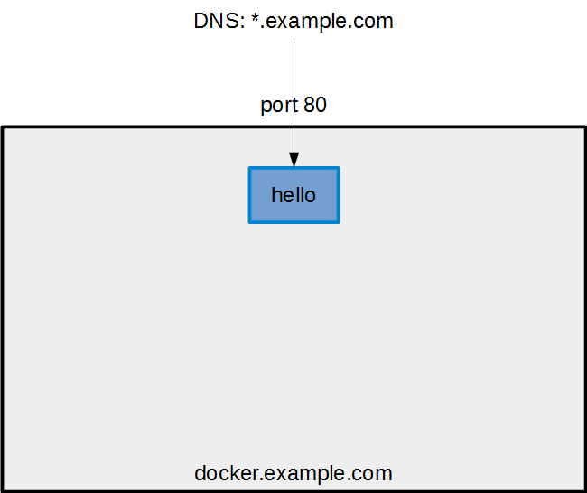
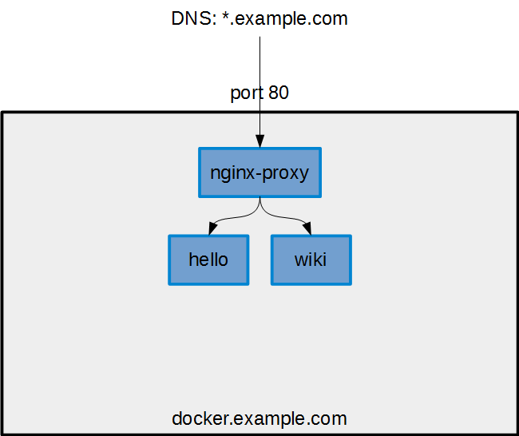
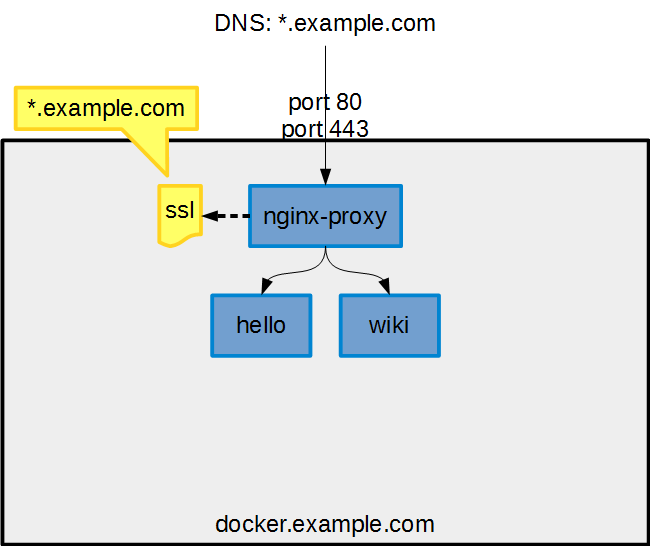
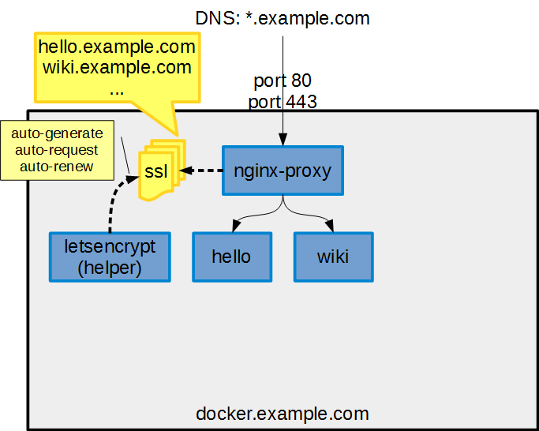
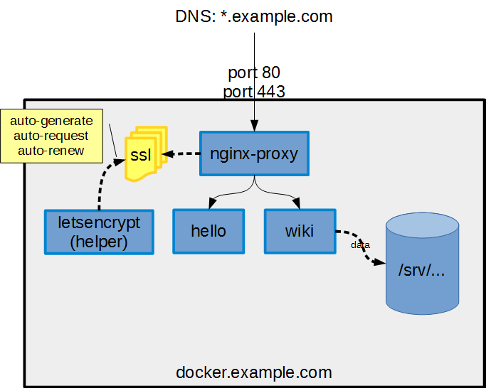
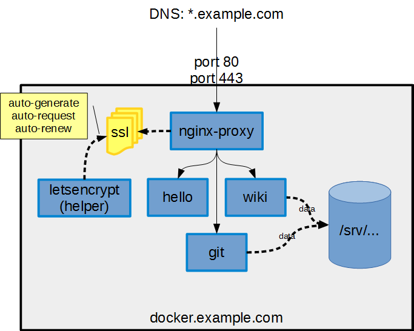
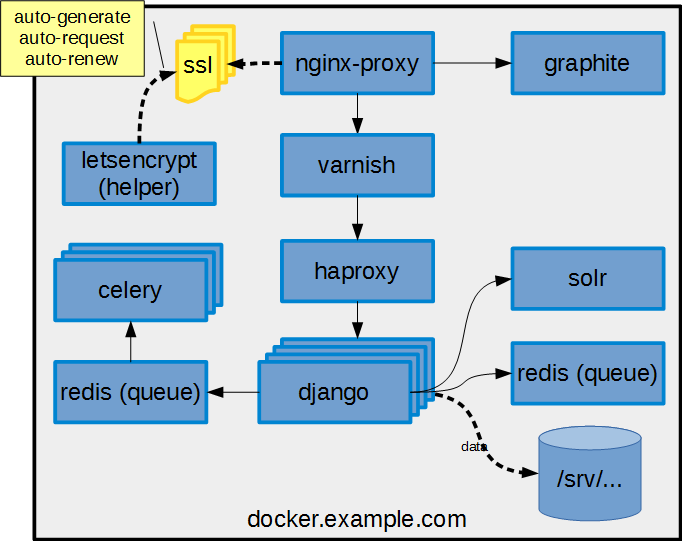

## Docker-compose by example

* Darren Wurf
* [darren.wurf@gmail.com](mailto:darren.wurf@gmail.com)

---

## Docker

* Docker is a useful abstraction for _processes_
    * Web application server (django/rails/tomcat/...)
    * Database
    * Reverse HTTP proxy (nginx/apache)
* ... each in their own Docker container.

* The process has all its code/binaries, libraries and configuration in a portable package.

---

## Docker Benefits

Why dockerise your service?

* Remove platform dependencies
    * essential OS parts are packaged with your app)
* Simplify installation / running
    * `docker run <service>`
* Manage external dependencies
    * control over files/directories, network ports, databases and other dependent processes
* Make Dev like Prod
    * Develop locally with a full app stack, without complex install and management

---

## Installing Docker

* Linux: https://docs.docker.com/engine/installation/
* Windows/OS X: use [docker toolbox](https://www.docker.com/products/docker-toolbox)

---

## Installing Docker

Or run these commands (Ubuntu):

        sudo apt-get update
        sudo apt-get -y install apt-transport-https
        sudo apt-key adv --keyserver hkp://p80.pool.sks-keyservers.net:80 --recv-keys 58118E89F3A912897C070ADBF76221572C52609D
        sudo sh -c "echo 'deb https://apt.dockerproject.org/repo ubuntu-$(lsb_release -cs) main' > /etc/apt/sources.list.d/docker.list"
        sudo apt-get update
        sudo apt-get -y install docker-engine
        sudo apt-get -y install curl
        sudo bash -c "curl -L https://github.com/docker/compose/releases/download/1.6.0-rc2/docker-compose-`uname -s`-`uname -m` > /usr/local/bin/docker-compose"
        sudo chmod u+x /usr/local/bin/docker-compose
        sudo docker-compose -v

---

## Live Demos!

---

## Live Demo: Hello World

Create + start

    sudo docker run \
        --name hello \
        --rm \
        -p 80:5000 \
        training/webapp

See what's in the container [here](https://hub.docker.com/r/training/webapp/~/dockerfile/)
Note: end '

---

## Live Demo: Hello World 
### docker-compose

`docker-compose.yml`

    hello:
        container_name: hello
        image: training/webapp
        restart: always
        ports:
            - 80:5000

Start/stop

        sudo docker-compose up -d
        sudo docker-compose down

---

## DNS Tricks

Quick and easy public docker containers

* Get a cheap domain (~$3/yr)
* Use Wildcard DNS to forward all requests to a single IP
* Use container `jwilder/nginx-proxy` for automatic HTTP routing

---

## Single-container setup

---

## Multiple container setup

---

## Live Demo: Multiple containers

`proxy/docker-compose.yml`

    proxy:
        container_name: proxy
        image: jwilder/nginx-proxy
        restart: always
        volumes:
            - /var/run/docker.sock:/tmp/docker.sock:ro
        ports:
            - 80:80

---

## Live Demo: Multiple containers

`hello/docker-compose.yml`

    hello:
        container_name: hello
        image: training/webapp
        restart: always
        environment:
            - VIRTUAL_HOST=hello.example.com
            - VIRTUAL_PORT=5000

`wiki/docker-compose.yml`

    wiki:
        container_name: wiki
        image: mazzolino/tiddlywiki
        restart: always
        environment:
            - VIRTUAL_HOST=wiki.example.com
            - VIRTUAL_PORT=8080

---

## SSL Tricks

Quick and easy _secure_ public docker containers

* Use Wildcard DNS to forward all requests to a single IP
* Get a wildcard SSL certificate (~$55 https://ssl2buy.com )
* Use container `jwilder/nginx-proxy` for automatic **HTTPS** routing

---

## Multiple containers with SSL

---

## Let's Encrypt

* Free automatic domain validated SSL certs for everyone!
* But what about our proxy? :(
* Already solved: `jrcs/letsencrypt-nginx-proxy-companion`
* Beware! Rate limit is 5 certs per domain per week (including subdomains)

Note: end '

---

## Multiple containers with Let's Encrypt SSL

Note: end '

---

## Live Demo: Multiple Containers + Let's Encrypt SSL

`proxy/docker-compose.yml`

    proxy:
        container_name: proxy
        image: jwilder/nginx-proxy
        restart: always
        volumes:
            - /var/run/docker.sock:/tmp/docker.sock:ro
            - /srv/docker/letsencrypt:/etc/nginx/certs:ro
            - /etc/nginx/vhost.d
            - /usr/share/nginx/html
        ports:
            - 80:80
            - 443:443
    letsencrypt:
        container_name: letsencrypt
        image: jrcs/letsencrypt-nginx-proxy-companion
        restart: always
        volumes:
            - /var/run/docker.sock:/var/run/docker.sock:ro
            - /srv/docker/letsencrypt:/etc/nginx/certs:rw
        volumes_from:
            - proxy

Note: end '

---

## Live Demo: Multiple containers

`hello/docker-compose.yml`

    hello:
        container_name: hello
        image: training/webapp
        restart: always
        environment:
            - VIRTUAL_HOST=hello.example.com
            - VIRTUAL_PORT=5000
            - LETSENCRYPT_HOST=hello.example.com
            - LETSENCRYPT_EMAIL=hello@example.com

`wiki/docker-compose.yml`

    wiki:
        container_name: wiki
        image: mazzolino/tiddlywiki
        restart: always
        environment:
            - VIRTUAL_HOST=wiki.example.com
            - VIRTUAL_PORT=8080
            - LETSENCRYPT_HOST=wiki.example.com
            - LETSENCRYPT_EMAIL=wiki@example.com

---

## Persistent storage

---

## Live Demo: Persistent storage

`wiki/docker-compose.yml`

    wiki:
        container_name: wiki
        image: mazzolino/tiddlywiki
        restart: always
        volumes:
            - /srv/docker/wiki:/var/lib/tiddlywiki
        environment:
            - VIRTUAL_HOST=wiki.example.com
            - VIRTUAL_PORT=8080
            - LETSENCRYPT_HOST=wiki.example.com
            - LETSENCRYPT_EMAIL=wiki@example.com

---

## Self-hosted github clone

---

## Live Demo: Gitbucket

`git/docker-compose.yml`

    git:
        container_name: git
        image: f99aq8ove/gitbucket
        restart: always
        volumes:
            - /srv/docker/git:/gitbucket
        ports:
            - 29418:29418
        environment:
            - VIRTUAL_HOST=git.example.com
            - VIRTUAL_PORT=8080
            - LETSENCRYPT_HOST=git.example.com
            - LETSENCRYPT_EMAIL=git@example.com

---

## Web Stack

* How do we harness docker to write a modern scalable web app?

* Some great presentations on web stacks:
    * [A New Default Web Stack](https://youtu.be/P68zXJ_ACCE) - Simon Willison (EventBrite)
    * [The inner guts of Bitbucket](https://youtu.be/v=2ll2ER3wpus) - Erik van Zijst (Atlassian)

---

## A Default Web Stack on Docker?

---

## Live Demo: full web stack

https://github.com/dwurf/default-web-stack/blob/master/docker-compose.yml

---

## Backup Considerations

* Use Volumes to control the location of data
    * Bind mount volumes are the easiest to work with
    * Find your data by inspecting `Dockerfile`s
* Place all data in one location
    * Standard location? I use `/srv/docker/<container>`
    * Use standard backup tools
    * Practice restores!

---

# End
